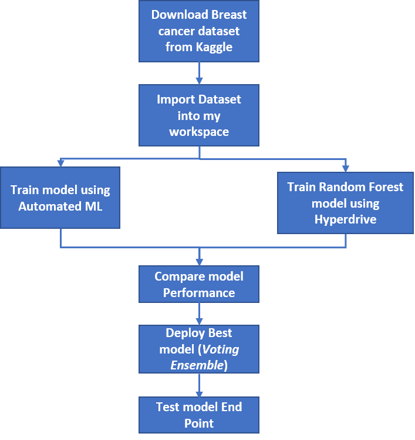

# Breast Cancer classification using Azure ML

Predict whether the cancer is benign or malignant using Azure Machine learning service. We  compare the results of Azure automated machine learning  and Hyperparameter tuning to solve this classification problem. Then we deploy the model on an Azure Container Serivce(ACI) as a respoint endpoint and test the endpoing by consuming it using an HTTP post request and get a prediction.
<p align='center'>
    
</p>

## Dataset

### Overview

We used the Breast Cancer Wisconsin (Diagnostic) Data Set.Features are computed from a digitized image of a fine needle aspirate (FNA) of a breast mass. They describe characteristics of the cell nuclei present in the image.
Dataset was download from Kaggle : [breast-cancer-wisconsin-data](https://www.kaggle.com/uciml/breast-cancer-wisconsin-data)
Also can be found on [UCI Machine Learning Repository](https://archive.ics.uci.edu/ml/datasets/Breast+Cancer+Wisconsin+%28Diagnostic%29)

### Task
We approach the project as a classification task. We wanted to classiy the cancer as benign or malignant based on the provided data.
The target column is Diagnosis (M = malignant, B = benign).


### Access
To access the data in my workspace i had to import the the csv file as a dataframe, do some cleaning, save the the as a csv before uploading in the datastore for it to be accessible via as a Tabular Dataset.

```
ds_tr = ws.get_default_datastore()
ds = Dataset.Tabular.from_delimited_files(path=ds_tr.path('cancerdata2/cancer_train_data.csv'))
```

## Automated ML
For the AutoML experiment we have the following  key settings. Most of them were set to limit the compute time and cost.

* Limit the number of iterations to 20
* Time limit fo experimentation is 20 minutes
* iteration should time ou in 10 minutes
* We enable early stopping 
* Use a 5 fold cross validation
* Limit the number of concurrent iteration to 3
* We enable featurization as we wanted AutoML to also evaludate different feature engineering of our numerical features

```
automl_settings = {
    "name": "udacity_AutoML_BreastCancer_{0}".format(time.time()),
    'iterations':20,
    "experiment_timeout_minutes" : 20,
    "enable_early_stopping" : True,
    "iteration_timeout_minutes": 10,
    "n_cross_validations": 5,
    "primary_metric": 'AUC_weighted',
    "max_concurrent_iterations": 3,
    'featurization': 'auto'
}

automl_config = AutoMLConfig(task='classification',
                             compute_target=gpu_cluster,
                             training_data = training_data,
                             label_column_name = 'diagnosis',
                             run_configuration = conda_run_config,
                             **automl_settings,
                             )
```

### Results
The best model from Auto ML is a VotingEnsemble with an AUC Weighted score of **0.9950**.
<p align='center'>
    
</p>

The AutoML Run details, the best model is the `VotingEnsemble` , followed by  `StackEnsemble` and `LightGBM`. In practice the gap 
between the performance of top 5 models is very negligible (expert for ML competition).

<p align='center'>
    
</p>

The best AutoML model parameters.
<p align='center'>
    
</p>

## Hyperparameter Tuning
For this experiment we used a Random Forest  ,which we fine tuned using Grid Sampling for the following hyperparameter : max_depth, max_features,min_sample_leaf,n_estimators.

```
ps = GridParameterSampling({
    "--max_depth":choice(3,6,12,20),
    "--max_features":choice('auto','sqrt','log2'),
    "--min_samples_leaf":choice(1,3,5),
    "--n_estimator":choice(20,40,100,1000)
})


# Specify a Policy
policy = BanditPolicy(slack_factor = 0.1, evaluation_interval=1, delay_evaluation=5)

estimator = ScriptRunConfig(source_directory='./scripts',
                      script='train.py',
                      compute_target=gpu_cluster,
                      environment=keras_env)

# Create a HyperDriveConfig using the estimator, hyperparameter sampler, and policy.
hyperdrive_config = HyperDriveConfig(run_config= estimator,
                             hyperparameter_sampling=ps,
                             policy=policy,
                             primary_metric_name="accuracy",
                             primary_metric_goal=PrimaryMetricGoal.MAXIMIZE,
                             max_total_runs=50,
                             max_concurrent_runs=4,
                             max_duration_minutes= 20)
```

### Results
With our Hyperparemeter configuration settings  and search space we obtained **0.965** accuracy with the Random Forest with a `max_depth` of 12, 20 `estimators`, `max_features` auto and `min_sample_leaf` of 1. We could have improved that results by increasing the `max_duration_minutes` which would allow Hyperdrive to explore 
more space in the Grid. Also doing feature engineering in this case could have improved the results.

<p align='center'>
    
</P>

Best Hyperdrive model
<p align='center'>
    
</P>


## Model Deployment
Based on those results we have deployed and test the best automl. To do so :

1. Get the best model from the training run
    ```
    from azureml.train.automl.run import AutoMLRun
    run_id = 'AutoML_0bcb2574-d48f-4b5c-9afa-e7dae19237fc_18'
    automl_training_run = AutoMLRun(exp,run_id)
    automl_training_run
    ```
2. Regsiter the model
   
   ```
   description = 'Breast Cancer Classification'
   model = automl_run.register_model(model_name = model_name,description= description,tags =None)

   ```
3. Download the score python file from azure ml
4. Create an inference configuration
5. Create an ACI deployment configuration
6. Deploy the model
    
    ```
    from azureml.core.environment import Environment 
    from azureml.core.webservice import AciWebservice,Webservice
    from azureml.core.model import Model,InferenceConfig

    aci_service_name = 'breast-cancer-classifier'
    inference_config = InferenceConfig(entry_script = script_filename, environment = best_run.get_environment())

    aciconfig = AciWebservice.deploy_configuration(cpu_cores=1, 
                                                    memory_gb=1, 
                                                    tags={'type':"breast-cancer-classification"}, 
                                                description='Udacity project Breast cancer classification')

    aciservice = Model.deploy(workspace=ws, 
                        name=aci_service_name, 
                        models=[model], 
                        inference_config=inference_config, 
                        deployment_config=aciconfig)

    aciservice.wait_for_deployment(show_output=True)
    ```


To consume the model
1. We copy the rest endpoint
2. Create a sample JSON payload
   
    ```
        test_sample = {"data" : [{"radius_mean":17.99,
                     "texture_mean":10.38,
                     "perimeter_mean":122.8,
                    "area_mean":1001.0,
                     "smoothness_mean":0.1184,
                     "compactness_mean":0.2776,
                     "concavity_mean":0.3001,
                     "concave points_mean":0.1471,
                     "symmetry_mean":0.2419,
                     "fractal_dimension_mean":0.07871,
                     "radius_se":1.095,
                     "texture_se":0.9053,
                     "perimeter_se":8.589,
                     "area_se":153.4,
                     "smoothness_se":0.006399,
                     "compactness_se":0.04904,
                     "concavity_se":0.05373,
                     "concave points_se":0.01587,
                     "symmetry_se":0.03003,
                     "fractal_dimension_se":0.006193,
                     "radius_worst":25.38,
                     "texture_worst":17.33,
                     "perimeter_worst":184.6,
                     "area_worst":2019.0,
                     "smoothness_worst":0.1622,
                     "compactness_worst":0.6656,
                     "concavity_worst":0.7119,
                     "concave points_worst":0.2654,
                     "symmetry_worst":0.4601,
                     "fractal_dimension_worst":0.1189}]}
    ```
3. Post the payload to the endpoint using a HTTP Post 
   
    ```
    import requests
    import json

    scoring_uri = 'http://85c4a414-e90c-4838-84ba-d7aa5295a446.eastus.azurecontainer.io/score'

    # Convert to JSON string
    input_data = json.dumps(test_sample)
    # Set the content type
    headers = {'Content-Type': 'application/json'}

    # Make the request and display the response
    resp = requests.post(scoring_uri, input_data, headers=headers)
    print(resp.json())
    ```

See below the registered model and endpoint screen
<p align='center'>
    
</P>

<p align='center'>
    
</P>

## Screen Recording
[Demo Video](https://youtu.be/NlXgNRcvn80)

## Future work

Next steps would be to investigate the Voting Ensemble and Hyperparameters to see how we could improve performance.
Also we could extend the project into more MLOps by adding source version control to the code and create a DevOps pipeline to kick our ML pipeline for training,testing and deployment.
